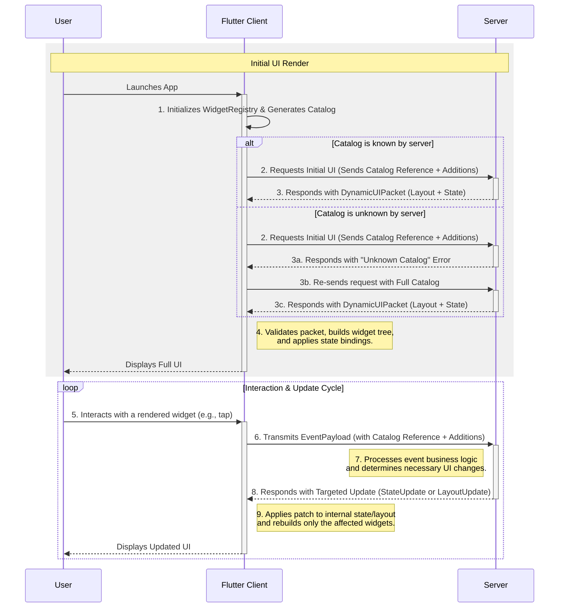

# **Flutter Composition Protocol**

A Specification for a Non-Recursive, JSON-Driven UI Framework for Flutter

## **Section 1: Foundational Architecture and Data Flow**

This document specifies the architecture and data formats for "Flutter Composition Protocol" (FCP), a framework for rendering Flutter user interfaces from a JSON definition. The design is guided by principles of strict separation of concerns, versioning, and targeted updates, with schemas constrained for compatibility with structured data generation models. It draws inspiration from existing solutions like Remote Flutter Widgets (RFW) while introducing a more formalized, contract-driven approach to enhance stability and predictability.

### **1.1. Core Philosophy: Decoupling and Contracts**

The central philosophy of FCP is the strict decoupling of four key elements, which together define the complete user interface:

1. **The Catalog (The Contract):** A client-defined document that specifies precisely which widgets, properties, events, and data structures the application is capable of handling. This is a static contract that governs all communication.
2. **The Layout (The Structure):** A server-provided JSON structure that describes the arrangement of widgets, their static properties, and their relationships to one another.
3. **The State (The Data):** A server-provided JSON object containing the dynamic values that populate the layout, such as text content, boolean flags, or lists of data.
4. **The Data Model (The Schemas):** A set of formal definitions for complex data objects used within the state, included within the Catalog to ensure type safety.

### **1.2. The DynamicUIPacket: The Atomic Unit of Communication**

All initial UI descriptions transmitted from the server to the client are encapsulated within a single, top-level JSON object: the `DynamicUIPacket`. This packet represents an atomic and self-contained description of a UI view at a specific moment.

The packet contains the following top-level keys:

- `formatVersion`: A semantic version string (e.g., "2.0.0") for the FCP specification itself.
- `layout`: The complete, non-recursive widget tree definition, as detailed in Section 3.
- `state`: The initial state data for the widgets defined in the layout, as detailed in Section 4.
- `metadata`: An optional object for server-side information.

### **1.3. Data Flow Model**

The data flow is a well-defined sequence:

1. **Client Initialization:** The Flutter app initializes its widget registry and generates its `WidgetCatalog`.
2. **Initial UI Request:** The client requests the initial UI from the server. This request includes a reference to a pre-agreed catalog (by name and version) and any local, client-side additions to that catalog.
3. **Server Response & Negotiation:** The server validates the catalog reference.
   - If the catalog is known, the server merges any additions and responds with a `DynamicUIPacket`.
   - If the catalog reference is unknown, the server responds with an error, prompting the client to resend its request with the complete catalog definition.
4. **Client-Side Rendering:** The client validates the packet against its catalog, then builds the Flutter widget tree by processing the layout and applying state bindings.
5. **User Interaction:** A user interacts with a widget (e.g., taps a button).
6. **Event Transmission:** The client constructs and sends a lightweight `EventPayload` to the server. This payload also includes the same catalog information as the initial request.
7. **Server-Side Logic & Targeted Update:** The server processes the event and responds with a delta-only payload—either a `LayoutUpdate` to change the structure or a `StateUpdate` to change data.
8. **Client-Side Patching:** The client applies the update, triggering targeted rebuilds of only the affected widgets.



## **Section 2: The Widget Catalog: Defining Capabilities and Data Models**

The `WidgetCatalog` is a JSON document that serves as a strict contract of the client's rendering and data-handling capabilities. While it can be a static file bundled with the application, it is typically generated at runtime from a `WidgetCatalogRegistry` where widget builders and their definitions are registered in code.

### **2.1. Purpose: The Client-Server Contract**

The catalog explicitly declares the client's capabilities, enabling:

- **Server-Side Validation:** The server can validate any `DynamicUIPacket` against the client's catalog before sending it.
- **Versioning and Coexistence:** The server can support a set of known catalog versions, allowing it to generate compatible UI for different client versions without requiring the client to send its full capabilities on every request.
- **Guided LLM Generation:** The catalog provides a structured schema that can be used to constrain the output of a Large Language Model, ensuring it only generates valid, renderable UI definitions.
- **Formalized Data Structures:** It allows for defining complex data types, ensuring that `state` objects are well-formed and type-safe.

### **2.2. Catalog Schema (`WidgetCatalog`)**

The catalog is a top-level JSON object:

- `catalogVersion`: A string representing the version of the catalog file itself (e.g., "2.1.0").
- `dataTypes`: An object where each key is a custom data type name (e.g., `User`), and the value is a JSON Schema definition for that type.
- `items`: An object where each key is a widget type name (e.g., `Container`), and the value is a `WidgetDefinition` object.

### **2.3. Custom Data Type Definitions (`dataTypes`)**

This section allows the client to declare reusable, complex data structures. This is crucial for domain modeling and ensuring that state updates are type-safe.

The value of each key under `dataTypes` **must** be a valid JSON Schema object.

```json
// Example: A dataTypes block defining User and Product models
"dataTypes": {
  "User": {
    "type": "object",
    "properties": {
      "id": { "type": "string" },
      "displayName": { "type": "string" },
      "isPremium": { "type": "boolean", "default": false }
    },
    "required": ["id", "displayName"]
  },
  "Product": {
    "type": "object",
    "properties": {
      "sku": { "type": "string" },
      "name": { "type": "string" },
      "price": { "type": "number" }
    },
    "required": ["sku", "name", "price"]
  }
}
```

### **2.4. Widget Definition Schema (`WidgetDefinition`)**

This object describes a single renderable widget type. It uses the JSON Schema standard to define its properties.

- `properties`: A **JSON Schema object** that defines the supported attributes for the widget. This allows for rich validation, including types, patterns, required fields, and nested objects.
- `events`: An object defining the events this widget can emit. Each key is an event name (e.g., `onPressed`), and the value is a JSON Schema defining the structure of the `arguments` object for that event.

```json
// Example: A WidgetDefinition for a 'Button' widget
"Button": {
  "properties": {
    "type": "object",
    "properties": {
      "text": { "type": "string" },
      "disabled": { "type": "boolean", "default": false },
      "child": { "type": "string", "description": "A WidgetId for a child." }
    },
    "required": ["text"]
  },
  "events": {
    "onPressed": {
      "type": "object",
      "properties": {}
    }
  }
}
```

## **Section 3: UI Composition: The Non-Recursive Layout Schema**

To meet the constraint of a non-recursive format, the FCP layout is defined using a flat adjacency list model.

### **3.1. The Adjacency List Model**

The layout is a flat list of `LayoutNode` objects. Parent-child relationships are established through ID references. This model allows for $O(1)$ amortized time lookup for any widget by its ID, which is critical for applying targeted updates efficiently.

### **3.2. Layout Schema (`Layout`)**

- `root`: A string containing the `id` of the root `LayoutNode`.
- `nodes`: An array of `LayoutNode` objects.

### **3.3. Layout Node Schema (`LayoutNode`)**

- `id`: A required, unique string that identifies this specific widget instance.
- `type`: A string that must match a widget type name in the `WidgetCatalog`.
- `properties`: An object containing static properties.
- `bindings`: An optional object that maps widget properties to the `state` object. See Section 4.2.
- `itemTemplate`: For list-building widgets, this is a complete `LayoutNode` object used as a template. See Section 3.4.

### **3.4. Advanced Composition: List Rendering with Builders**

To efficiently render dynamic lists (e.g., search results), the framework supports a builder pattern. This avoids defining a `LayoutNode` for every single item in a list.

A special widget type, e.g., `ListViewBuilder`, can be defined in the catalog. It uses a combination of data binding and a template to generate its children.

- **`properties`**: The builder widget itself would have standard properties (e.g., `scrollDirection`).

- **`bindings`**: It would have a binding to an array in the state object.

```json
"bindings": { "data": { "path": "products" } }
```

- **`itemTemplate`**: It contains a single `LayoutNode` definition that serves as a template for each item. This template can use special binding paths like `item.name` or `item.price`, which the client resolves for each element of the bound `data` list.

```json
// Example: A node for a ListViewBuilder
{
  "id": "product_list",
  "type": "ListViewBuilder",
  "properties": { "scrollDirection": "vertical" },
  "bindings": { "data": { "path": "products" } },
  "itemTemplate": {
    "id": "product_item_template",
    "type": "ListItem",
    "properties": {},
    "bindings": {
      "title": { "path": "item.name" },
      "subtitle": { "path": "item.price", "format": "${}" }
    }
  }
}
```

## **Section 4: Dynamic Data: The State Management Schema**

FCP enforces a clean separation between the UI's structure (layout) and its dynamic data (state).

### **4.1. The `state` Object: A Centralized Data Store**

The `state` key in the `DynamicUIPacket` holds a single JSON object. This is the sole source of truth for all dynamic data. By defining the structure of its contents in the catalog's `dataTypes` section, the state object is not an arbitrary blob but a well-defined, validatable data model. For example, the state could contain a `currentUser` object that is validated against the `User` schema from the catalog.

### **4.2. Data Binding with Transformations**

The `bindings` map within a `LayoutNode` forges the connection between layout and state. This mechanism is enhanced to support simple, client-side data transformations.

A binding value is an object that specifies the `path` to the data in the state and an optional transformation.

```json
// General structure of a binding object
"bindings": {
  "widgetProperty": {
    "path": "path.to.data.in.state",
    // Optional transformer below
    "format": "Value is: {}"
  }
}
```

**Supported Transformations:**

- **`format`**: A string with a `{}` placeholder, which will be replaced by the value from `path`.

  - Example: `{"path": "user.name", "format": "Welcome, {}!"}`

- **`condition`**: Evaluates a path to a boolean. Can be used to conditionally provide a value.

  - `ifValue`: The value to use if the path is `true`.

  - `elseValue`: The value to use if the path is `false`.

  - Example: `{"path": "user.isPremium", "condition": {"ifValue": "Premium User", "elseValue": "Standard User"}}`

- **`map`**: Maps a value to another value. Useful for enum-like state.

  - `mapping`: An object where keys are possible state values and values are the desired output.

  - `fallback`: A value to use if the state value is not in the map.

  - Example: `{"path": "status", "map": {"mapping": {"active": "#FF00FF00", "inactive": "#FFFF0000"}, "fallback": "#FF888888"}}`

This small, predefined set of transformers adds significant declarative power without the security risks of a full expression language.

## **Section 5: Event Handling and Targeted Updates**

### **5.1. Client-to-Server: The `EventPayload`**

When a user triggers an event, or for the initial UI request, the client sends a payload to the server that includes information about its capabilities. For events, this is the `EventPayload`.

To support a stateless server architecture, the client must identify its catalog of capabilities with each request. This is done using one of two strategies:

1.  **By Reference:** The client sends a reference to a known base catalog, plus any local additions. This is the standard, lightweight mode of operation.
2.  **By Value:** If the server does not recognize the catalog reference, it will reject the request. The client must then resend the request, this time embedding its complete catalog.

The `EventPayload` is structured as follows:

- `catalogReference`: An optional object identifying a pre-agreed base catalog.
  - `name`: The name of the base catalog (e.g., "material").
  - `version`: The semantic version of the base catalog (e.g., "1.2.1").
- `catalogAdditions`: An optional, partial `WidgetCatalog` object containing any client-specific widgets or data types that augment the base catalog.
- `fullCatalog`: An optional, complete `WidgetCatalog` object. This is sent only when the server does not recognize the `catalogReference` or when no base catalog is used.
- `sourceNodeId`: The `id` of the `LayoutNode` that generated the event.
- `eventName`: The name of the event (e.g., `onPressed`).
- `timestamp`: An ISO 8601 string representing when the event occurred.
- `arguments`: An optional object containing contextual data. The structure of this object **must** conform to the schema defined for this event in the resolved `WidgetCatalog`.

### **5.2. Server-to-Client: The `StateUpdate` Payload**

To change only dynamic data, the server sends a `StateUpdate` payload. This payload uses a hybrid model of operations designed to be both powerful for granular updates and simple for Large Language Models (LLMs) to generate, avoiding the brittleness of index-based list modifications.

The payload contains a single `operations` array, where each object is a specific command.

#### **5.2.1. The `patch` Operation**

This operation performs a single, targeted modification using a pathing system that relies on unique item IDs instead of array indices.

- `op`: `"patch"`
- `patch`: A JSON Patch-like object: `{ "op": "replace" | "add" | "remove", "path": "...", "value": ... }`.
- **Path Syntax**: The `path` string uses a special syntax for lists: `/listName/key:value/propertyName`. For example, to target the `price` of a product with `sku` "abc-123", the path would be `/products/sku:abc-123/price`.

```json
{
  "op": "patch",
  "patch": {
    "op": "replace",
    "path": "/products/sku:abc-123/price",
    "value": 35.99
  }
}
```

#### **5.2.2. High-Level List Operations**

These commands provide simple, semantic shortcuts for common list manipulations.

- **`listAppend`**: Appends one or more items to the end of a list.
  - `path`: Path to the target list.
  - `items`: An array of full item objects to add.

```json
{
  "op": "listAppend",
  "path": "/products",
  "items": [{ "sku": "xyz-789", "name": "New Gadget", "price": 10.0 }]
}
```

- **`listRemove`**: Removes items from a list based on their unique keys.
  - `path`: Path to the target list.
  - `itemKey`: The name of the unique ID property (e.g., `"sku"`).
  - `keys`: An array of key values to remove.

```json
{
  "op": "listRemove",
  "path": "/products",
  "itemKey": "sku",
  "keys": ["def-456"]
}
```

- **`listUpdate`**: Replaces entire items in-place, finding them by their unique key.
  - `path`: Path to the target list.
  - `itemKey`: The name of the unique ID property.
  - `items`: An array of full item objects that will replace their existing counterparts.

```json
{
  "op": "listUpdate",
  "path": "/products",
  "itemKey": "sku",
  "items": [{ "sku": "abc-123", "name": "Updated Gadget", "price": 35.99 }]
}
```

### **5.3. Server-to-Client: The `LayoutUpdate` Payload**

For surgical modifications to the UI's structure, the server sends a `LayoutUpdate` payload with a simpler, custom operation set.

- `operations`: An array of layout modification objects. Each object specifies an `op` (`add`, `remove`, `replace`), the nodes to modify, and targeting information.

## **Section 6: Complete JSON Schema Definitions**

This section provides the formal, consolidated, and valid JSON Schema definitions for the FCP framework.

### **6.1. FCP Payloads and Catalog Schema**

This schema defines the objects that are actively exchanged between the client and server. It includes the `WidgetCatalog` definition, as the catalog is a potential part of the communication payload.

```json
{
  "$schema": "https://json-schema.org/draft/2020-12/schema",
  "$id": "https://example.com/FCP-payloads-schema-v2.json",
  "title": "FCP Communication Payloads and Catalog Schema",
  "description": "A collection of schemas for data exchanged between client and server in the FCP framework.",
  "type": "object",
  "$defs": {
    "WidgetDefinition": {
      "type": "object",
      "properties": {
        "properties": {
          "type": "object",
          "description": "A JSON Schema object defining the properties for this widget."
        },
        "events": {
          "type": "object",
          "additionalProperties": {
            "type": "object",
            "description": "A JSON Schema defining the 'arguments' object for this event."
          }
        }
      },
      "required": ["properties"]
    },
    "WidgetCatalog": {
      "type": "object",
      "properties": {
        "catalogVersion": {
          "type": "string",
          "pattern": "^\\d+\\.\\d+\\.\\d+$"
        },
        "dataTypes": {
          "type": "object",
          "description": "A map of custom data type names to their JSON Schema definitions.",
          "additionalProperties": {
            "type": "object"
          }
        },
        "items": {
          "type": "object",
          "additionalProperties": {
            "$ref": "#/$defs/WidgetDefinition"
          }
        }
      },
      "required": ["catalogVersion", "items"]
    },
    "PartialWidgetCatalog": {
      "type": "object",
      "properties": {
        "dataTypes": {
          "type": "object",
          "description": "A map of custom data type names to their JSON Schema definitions.",
          "additionalProperties": {
            "type": "object"
          }
        },
        "items": {
          "type": "object",
          "additionalProperties": {
            "$ref": "#/$defs/WidgetDefinition"
          }
        }
      }
    },
    "CatalogReference": {
      "type": "object",
      "properties": {
        "name": {
          "type": "string"
        },
        "version": {
          "type": "string",
          "pattern": "^\\d+\\.\\d+\\.\\d+$"
        }
      },
      "required": ["name", "version"]
    },
    "LayoutNode": {
      "type": "object",
      "properties": {
        "id": {
          "type": "string",
          "description": "Unique identifier for this widget instance. Must contain only alphanumeric characters, hyphens, and underscores.",
          "pattern": "^[a-zA-Z0-9_-]+$"
        },
        "type": {
          "type": "string",
          "description": "The type of the widget, must match a key in the WidgetCatalog."
        },
        "properties": {
          "type": "object",
          "description": "Static properties for this widget."
        },
        "bindings": {
          "type": "object",
          "description": "Binds widget properties to paths in the state object, with optional transformations."
        },
        "itemTemplate": {
          "$ref": "#/$defs/LayoutNode",
          "description": "A template node for list builder widgets."
        }
      },
      "required": ["id", "type"]
    },
    "Layout": {
      "type": "object",
      "properties": {
        "root": {
          "type": "string",
          "description": "The ID of the root layout node."
        },
        "nodes": {
          "type": "array",
          "items": {
            "$ref": "#/$defs/LayoutNode"
          }
        }
      },
      "required": ["root", "nodes"]
    },
    "DynamicUIPacket": {
      "type": "object",
      "properties": {
        "formatVersion": {
          "type": "string",
          "pattern": "^\\d+\\.\\d+\\.\\d+$"
        },
        "layout": {
          "$ref": "#/$defs/Layout"
        },
        "state": {
          "type": "object"
        },
        "metadata": {
          "type": "object"
        }
      },
      "required": ["formatVersion", "layout", "state"]
    },
    "EventPayload": {
      "type": "object",
      "properties": {
        "catalogReference": {
          "$ref": "#/$defs/CatalogReference"
        },
        "catalogAdditions": {
          "$ref": "#/$defs/PartialWidgetCatalog"
        },
        "fullCatalog": {
          "$ref": "#/$defs/WidgetCatalog"
        },
        "sourceNodeId": {
          "type": "string"
        },
        "eventName": {
          "type": "string"
        },
        "timestamp": {
          "type": "string",
          "format": "date-time"
        },
        "arguments": {
          "type": "object"
        }
      },
      "required": ["sourceNodeId", "eventName", "timestamp"]
    },
    "StateUpdate": {
      "type": "object",
      "properties": {
        "operations": {
          "type": "array",
          "description": "A series of operations to apply to the state.",
          "items": {
            "oneOf": [
              {
                "type": "object",
                "title": "Patch Operation",
                "properties": {
                  "op": {
                    "const": "patch"
                  },
                  "patch": {
                    "type": "object",
                    "properties": {
                      "op": {
                        "enum": ["add", "remove", "replace"]
                      },
                      "path": {
                        "type": "string",
                        "description": "A path to a value in the state. For lists, use 'key:value' to select an item (e.g., /products/sku:abc-123/price). Where the key is the key used to identify a child, and the value is the identity.",
                        "pattern": "^(/([a-zA-Z0-9_-]+:[^/]+|[a-zA-Z0-9_-]+))+$"
                      },
                      "value": {}
                    },
                    "required": ["op", "path"]
                  }
                },
                "required": ["op", "patch"]
              },
              {
                "type": "object",
                "title": "List Append Operation",
                "properties": {
                  "op": {
                    "const": "listAppend"
                  },
                  "path": {
                    "type": "string",
                    "description": "A path to a list in the state.",
                    "pattern": "^(/([a-zA-Z0-9_-]+:[^/]+|[a-zA-Z0-9_-]+))+$"
                  },
                  "items": {
                    "type": "array"
                  }
                },
                "required": ["op", "path", "items"]
              },
              {
                "type": "object",
                "title": "List Remove Operation",
                "properties": {
                  "op": {
                    "const": "listRemove"
                  },
                  "path": {
                    "type": "string",
                    "description": "A path to a list in the state.",
                    "pattern": "^(/([a-zA-Z0-9_-]+:[^/]+|[a-zA-Z0-9_-]+))+$"
                  },
                  "itemKey": {
                    "type": "string"
                  },
                  "keys": {
                    "type": "array",
                    "items": {
                      "type": "string"
                    }
                  }
                },
                "required": ["op", "path", "itemKey", "keys"]
              },
              {
                "type": "object",
                "title": "List Update Operation",
                "properties": {
                  "op": {
                    "const": "listUpdate"
                  },
                  "path": {
                    "type": "string",
                    "description": "A path to a list in the state.",
                    "pattern": "^(/([a-zA-Z0-9_-]+:[^/]+|[a-zA-Z0-9_-]+))+$"
                  },
                  "itemKey": {
                    "type": "string"
                  },
                  "items": {
                    "type": "array"
                  }
                },
                "required": ["op", "path", "itemKey", "items"]
              }
            ]
          }
        }
      },
      "required": ["operations"]
    },
    "LayoutUpdate": {
      "type": "object",
      "properties": {
        "operations": {
          "type": "array",
          "items": {
            "type": "object",
            "properties": {
              "op": {
                "type": "string",
                "enum": ["add", "remove", "replace"]
              },
              "nodes": {
                "type": "array",
                "items": {
                  "$ref": "#/$defs/LayoutNode"
                }
              },
              "nodeIds": {
                "type": "array",
                "items": {
                  "type": "string"
                }
              },
              "targetNodeId": {
                "type": "string"
              },
              "targetProperty": {
                "type": "string"
              }
            },
            "required": ["op"]
          }
        }
      },
      "required": ["operations"]
    },
    "UnknownCatalogError": {
      "type": "object",
      "properties": {
        "error": {
          "const": "UnknownCatalog"
        },
        "message": {
          "type": "string"
        },
        "requestedReference": {
          "$ref": "#/$defs/CatalogReference"
        }
      },
      "required": ["error", "message"]
    }
  },
  "oneOf": [
    {
      "$ref": "#/$defs/DynamicUIPacket"
    },
    {
      "$ref": "#/$defs/EventPayload"
    },
    {
      "$ref": "#/$defs/StateUpdate"
    },
    {
      "$ref": "#/$defs/LayoutUpdate"
    },
    {
      "$ref": "#/$defs/UnknownCatalogError"
    }
  ]
}
```

## **Section 7: Client-Side Implementation and Best Practices**

### **7.1. The FCP Interpreter**

A robust client-side interpreter should be composed of several key components:

- **Parser and Validator:** Deserializes JSON and validates payloads against both the master schema and the client's `WidgetCatalog`. This includes validating parts of the `state` object against the schemas provided in `dataTypes`.
- **Widget Tree Builder:** Constructs the Flutter widget tree. This is typically driven by a `WidgetCatalogRegistry` that maps widget type names to concrete Flutter builder functions.
- **State Manager:** Holds the state object and notifies listening widgets to rebuild when a `StateUpdate` is applied.
- **Binding Processor:** A crucial component responsible for resolving binding paths and applying the declared transformations.
- **Update Applier:** Processes incoming `StateUpdate` and `LayoutUpdate` payloads.

### **7.2. Performance Considerations**

- **Granular Rebuilds:** A change to a single value in the state should only trigger a rebuild of the specific widgets bound to that value.

- **Efficient List Building:** Use Flutter's `ListView.builder` under the hood for FCP's `ListViewBuilder` to ensure that list items are only built as they are scrolled into view.

- **`const` Widgets:** Use `const` widgets in the client-side mapping code wherever possible.

### **7.3. Error Handling**

- **Invalid Payloads:** Handle malformed JSON or payloads that do not conform to the schema.

- **Catalog Violations:** If the server sends a layout that violates the `WidgetCatalog` (e.g., unknown widget, bad property type, malformed state object according to a `dataType` schema), the client should log the error and display a fallback UI, not crash.

- **Broken Bindings:** If a binding path is invalid or a transformation fails, the client should use a default value or display a visual error indicator.
